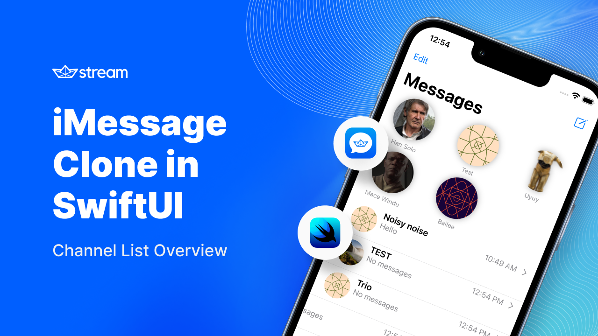

# iMessage clone with SwiftUI and the StreamChatSwiftUI SDK

This repository contains the source code of the tutorial series on how to re-create the famous iMessage app from Apple with the StreamChatSwiftUI SDK and SwiftUI.

It was created as a best-practice repository that showcases some of the best ways to customize the SDK and bring in your own style. There is a number of ongoing tutorials associated with this topic that are shown below with their current state:

* [Youtube Tutorial on creating the Channel List](https://youtu.be/526swCwDMX8) (*published*)
* [Youtube Tutorial on creating the Message List](https://youtu.be/8Nkmk85H8HQ) (*published*)
* Youtube Tutorial on implementing Custom Message Effects (*planned*)

If you want to learn more about the SDK and to create your own Maker account and get started for free, head over to [getstream.io](https://getstream.io).

Other links that might be helpful to you:

* [StreamChatSwiftUI Package](https://github.com/GetStream/stream-chat-swiftui)
* [SwiftUI tutorial](https://getstream.io/tutorials/swiftui-chat/) on getting started with the StreamChat SDK
* [SwiftUI docs](https://getstream.io/chat/docs/sdk/ios/swiftui/)

If you have questions about anything SwiftUI related, also feel free to reach out to [Martin Mitrevski](https://twitter.com/mitrevski) and/or [Stefan Blos](https://twitter.com/stefanjblos)
